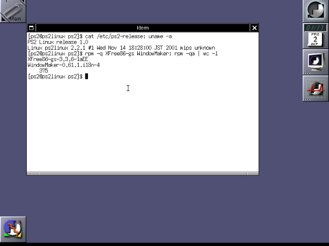

# PS2 Linux 1.0 on WhiteRhino

Sony's **Linux (for PlayStation 2) Release 1.0** (PAL, January 2002; kernel 2.2.1 built
November 2001) running in an emulator, from the original Runtime Environment disc up to
X and WindowMaker, with keyboard, mouse, network and the hard disk.



The emulator is [WhiteRhino](https://github.com/Arawn-Davies/whiterhino), a PCSX2 fork
for booting operating systems on the PS2. Stock PCSX2/WhiteRhino does not get there:
this repository holds the 13 patches that were needed, and the scripts that build a
bootable hard disk from your own PS2 Linux 1.0 discs.

No Sony software is included: you need your own DISC 1, DISC 2 and a PS2 BIOS.

## What was wrong, and the patches

The patches apply to WhiteRhino commit `91c63d21d8aa991aef3e13b3520cf522e0315a92`
(2026-08-23), in order, with `git am`. Each commit message explains the bug.

| # | Patch | Symptom without it |
|---|-------|--------------------|
| 1 | EE: vary COP0 Random between back-to-back TLB refills | two TLB refills evict each other forever |
| 2 | EE: hand user-mode SYSCALLs to the guest kernel | the BIOS syscall HLE answers the guest's syscalls |
| 3 | EE: raise Coprocessor Unusable when Status.CU1 is clear | Linux 2.2 lazy FPU switching breaks; processes corrupt each other |
| 4 | DEV9: EEPROM dummy bit, SMAP TX status | NetBSD 1.6A: bad MAC checksum, every packet an error |
| 5 | USB OHCI: mask addresses to the IOP bus | NetBSD 1.6A: USB transfers out of range |
| 6 | USB keyboard: grave accent key | `` ` `` and `~` never reach the guest |
| 7 | Log: message cap | long OS boots stop logging |
| 8 | **IOP DMA8: advance MADR** | **only the first 4 KB of each disk read are right** |
| 9 | **DEV9: FIFO writes that wrap or exceed 8 KB** | **disk writes stall, the guest resets the drive** |
| 10 | **ATA: reset DMA counters per command** | **heap corruption, emulator aborts** |
| 11 | GS: VESA up to 1280x1024 | X at 800x600 shows only the top-left 640x480 |
| 12 | Automatic disc changer for the RTE | swap DISC 2 / DISC 1 by hand on every boot |
| 13 | Input: absolute USB mouse mode | in a VM or under Wayland the guest pointer sticks to the edges |

Patches 1 to 7 come from getting NetBSD 1.6A/playstation2 to run on the same emulator;
PS2 Linux needs 2, 3 and 6 as well. Patches 8 to 10 are bugs in PCSX2's DEV9/IOP code
that any guest doing DMA to the hard disk can hit.

### How the pieces were found

- **Disk reads (8).** Sony's kernel asked for the right sectors (ATA command log), yet
  files longer than 48 KB came back wrong. Hashing each stage (ATA buffer, IOP DMA8
  blocks, SIF0 to the EE) showed every 4 KB DMA8 block landing on the same IOP address,
  while SIF0 read the following ones: Sony's ATA relay sets MADR once and relies on it
  advancing.
- **Disk writes (9, 10).** `hda: timeout waiting for DMA` and then
  `corrupted size vs. prev_size`. The guest writes 12 KB per IOP block; the FIFO holds
  8 KB and the write path drained it once and never refilled it. The aborted transfer
  left `wrTransferred` set and the next command copied past its buffer.
- **The Boot button.** The RTE menu skips "Boot" even with a valid boot memory card;
  the strings next to it in `PBPX_955.09` read "This function isn't implemented yet".
  `make-disc1-boot.py` repurposes "Rescue" instead (see below).
- **Disc swaps (12).** The RTE has its own CD reader and identifies the discs by the
  marker files `P2L_0100.01` / `P2L_0100.02`; any re-mastered image (xorriso,
  genisoimage) crashes it. The disc check is the function at `0x010067a4`, with the
  wanted disc in `s0`, so the emulator loads that disc when the EE gets there.
- **The mouse (13).** With a USB mouse bound, PCSX2 grabs the pointer and warps it back
  to the centre. A VirtualBox guest with mouse integration, and Wayland, ignore the
  warps; reproduced with absolute-only pointer motion, fixed with an absolute mode,
  measured one to one afterwards.

## Building

### 1. The emulator

```sh
git clone https://github.com/Arawn-Davies/whiterhino.git
cd whiterhino
git checkout 91c63d21d8aa991aef3e13b3520cf522e0315a92
git am /path/to/this/repo/patches/*.patch
```

Then build it as WhiteRhino/PCSX2 describe (Linux, CMake, Qt 6). The result used here is
`build/bin/pcsx2-qt`.

### 2. The discs

```sh
scripts/make-disc1-boot.py DISC1.iso media/DISC1-boot.iso
```

This changes one line of DISC 1's `p2lboot.cnf`, in place and with the same length: the
`.Rescue` entry boots the DISC 2 kernel with `root=/dev/hda1` and no initrd, instead of
the rescue initrd. Keep DISC 2 as it is.

### 3. The hard disk (as root, on Linux)

```sh
sudo DISC2=media/DISC2.iso HDD=ps2linux-hdd.raw scripts/build-hdd.sh
```

It needs `sfdisk`, `mke2fs`, `rpm` (`rpm2cpio`, `rpm -qp`), `cpio`, `readelf` and
`python3`, and takes a few minutes. What it does:

- the Sony partition layout (DOS label, hda1 ext2 revision 0, hda5 swap);
- the 375 packages of "WindowMaker Workstation" (`config/packages.txt`, made from DISC 2
  by `scripts/select-packages.py`), unpacked with `rpm2cpio`;
- owners and modes from the RPM headers, soname links, `ld.so.conf`;
- the configuration Sony's installer writes (fstab, network by DHCP, US keyboard,
  runlevel 5 with `wdm`, the `Xgsx` server with `config/XGSConfig`: VESA 800x600,
  24 bits, and no pointer acceleration);
- `/root/first-boot.sh`, run once from `rc.local`: the RPM `%pre`/`%post` scriptlets in
  order, users and passwords, the RPM database (from copies of the RPMs left on the disk
  and deleted afterwards), and the two services the scriptlets add too late for that
  boot (`xfs`, and `xinitrc`, which sets the default session to WindowMaker).

Users: `root` and `ps2`, password `ps2linux` (set `ROOT_PASSWORD` / `USER_PASSWORD`).
Time zone: `TZ_NAME` (default `UTC`).

### 4. Running

```sh
scripts/run.sh
```

(see the top of the script for the paths it expects). In the blue Runtime Environment
menu press **Right** once (it lands on "Rescue") and **Enter**; the emulator swaps the
discs by itself. The graphical login appears about five minutes after Enter; the first
boot takes longer, as it registers the packages. To shut down: `su -`, `shutdown -h now`; the emulator window
closes by itself.

The EE runs in the interpreter (the recompiler does not deliver the TLB exceptions a
guest kernel needs), so everything is slow but works.

## License

GPL-3.0-or-later, the license of PCSX2 and WhiteRhino; see `LICENSE`. PS2 Linux,
its discs and the PS2 BIOS are Sony's and are not part of this repository.
